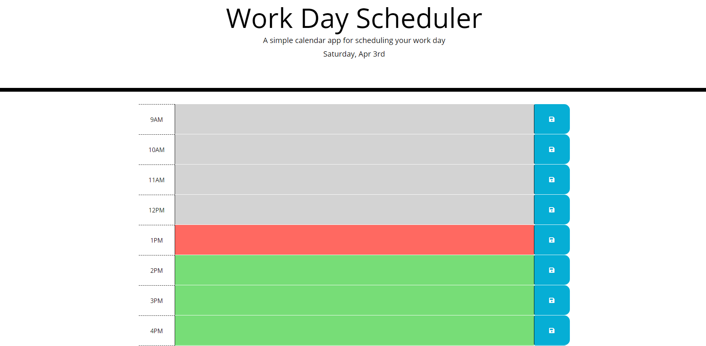
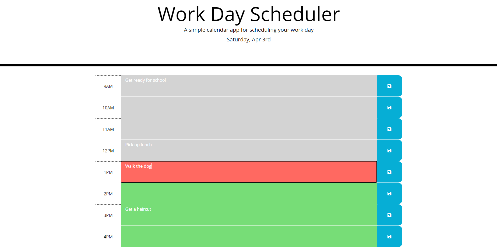

# work-day-scheduler

## 4/2/21

This application can track the time and will display a color based on the current hour of the day. Hours that have passed will be grey, the current hour will be red, and future hours will be green. Any text that is entered will be saved upon clicking the corresponding save icon next to the box. When the page is reloaded, all text that has previously been saved will load in the appropriate time slot.

## Link to Application

https://keddie024.github.io/work-day-scheduler/

## Images of Application

